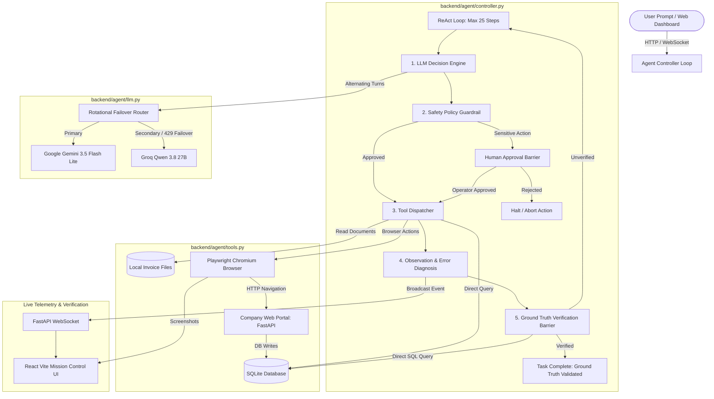
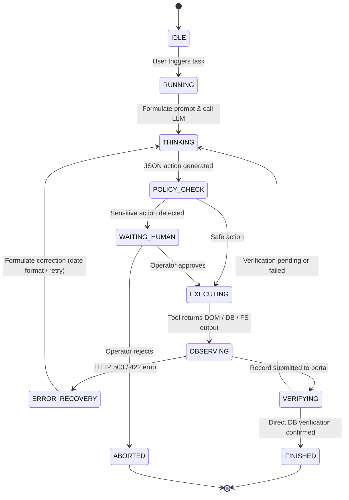

# System Architecture & Technical Specifications

This document provides a comprehensive technical overview of the **Autonomous AI Task Worker** architecture, detailing its subsystems, execution sequence, verification barriers, and state machine.

---

## 1. High-Level System Architecture



---

## 2. Core Architectural Subsystems

### 2.1 The Agent Controller Loop (`backend/agent/controller.py`)
The controller implements an autonomous **ReAct** (Reasoning + Acting) loop:
1. **Context Management**: Formats the system prompt, tool schemas, past conversation history, and the current task into turn messages.
2. **Step Limitation**: Enforces a strict `MAX_STEPS=25` ceiling to prevent runaway executions.
3. **Precondition Barrier**: The controller intercepts the `finish(status="success")` tool and validates whether `verify_record` was successfully executed. If the agent attempts to finish without database verification, the action is rejected and the agent is instructed to verify ground truth first.

### 2.2 Dual-Provider Rotational LLM Engine (`backend/agent/llm.py`)
* **Dynamic Provider Rotation**: Alternates between Google Gemini (`gemini-3.5-flash-lite`) and Groq (`qwen/qwen3.8-27b`) on successive turns.
* **Failover on Rate Limiting**: If Gemini returns HTTP 429 (Resource Exhausted) or 503, the system immediately routes the request to Groq without losing context or terminating the task.
* **Strict JSON Extraction**: Handles LLMs outputting markdown code blocks (` ```json ... ``` `) and uses regex extraction to parse valid JSON dictionaries matching `{ "thought": "...", "tool": "...", "args": { ... } }`.

### 2.3 Tool Dispatcher & Browser Automation (`backend/agent/tools.py`)
* **File Operations**:
  * `list_files(directory)`: Scans available invoices in `backend/data/invoices/`.
  * `read_file(path)`: Reads raw invoice content.
  * `extract_invoice(path)`: Parses document fields (vendor, invoice number, issue date, due date, subtotal, total).
* **Playwright Browser Driver**:
  * `goto(url)`: Navigates to the portal form (`/portal/new`) or record viewer (`/portal/records`).
  * `fill(selector, value)`: Inputs vendor, invoice number, amount, and due date.
  * `click(selector)`: Submits the form or triggers portal actions.
  * `screenshot(name)`: Captures visual state saved to `backend/screenshots/` and streamed to the UI.
* **Database & Verification Tools**:
  * `get_record(invoice_number)`: Queries SQLite directly to inspect existing records.
  * `verify_record(invoice_number, vendor, amount, due_date)`: Independent out-of-band comparator confirming that the database contains the exact expected values.

### 2.4 Safety Policy & HITL Guardrail (`backend/agent/policy.py`)
* Evaluates requested tool calls against safety rules before execution.
* Classifies actions:
  * **Safe**: Read files, navigate browser, fill form, query database.
  * **Sensitive/Destructive**: Deletion of records, financial transactions above threshold, ambiguous vendor operations.
* When a sensitive action is detected, the controller halts and emits a `waiting_human` event over WebSocket. Execution resumes only after an operator clicks Approve or Reject on the dashboard.

### 2.5 Real-Time Telemetry & WebSocket Streaming (`backend/main.py`)
* Runs the agent controller in a separate daemon thread to ensure non-blocking operation.
* Emits fine-grained events: `agent_start`, `agent_step`, `agent_thought`, `agent_tool`, `agent_observation`, `waiting_human`, `agent_screenshot`, and `agent_finish`.
* The React frontend consumes these events in real time, rendering an activity log, visual screenshots, and database table updates.

---

## 3. End-to-End Execution Sequence

```mermaid
sequenceDiagram
    autonumber
    actor User as Operator (Dashboard/CLI)
    participant Ctrl as Agent Controller
    participant LLM as LLM Engine (Gemini / Groq)
    participant Pol as Safety Policy
    participant Tools as Playwright & FS Tools
    participant Portal as Internal Web Portal
    participant DB as SQLite Database

    User->>Ctrl: Start Task: "Process latest ABC invoice"
    Ctrl->>LLM: Prompt + Tools + Context
    LLM-->>Ctrl: {"thought": "List invoices", "tool": "list_files", ...}
    Ctrl->>Pol: Validate action
    Pol-->>Ctrl: Safe
    Ctrl->>Tools: list_files("data/invoices")
    Tools-->>Ctrl: [ABC_INV-198, ABC_INV-204, ABC_INV-211, ...]

    Ctrl->>LLM: Files listed. Decide next step.
    LLM-->>Ctrl: {"thought": "Read documents to compare dates", "tool": "read_file", ...}
    Ctrl->>Tools: read_file("ABC_INV-204.txt") & read_file("ABC_INV-211.txt")
    Tools-->>Ctrl: INV-204 date: 2026-10-01; INV-211 date: 2026-09-15
    
    Note over Ctrl,LLM: Resolves INV-204 as newest despite filename 211 > 204

    Ctrl->>LLM: Next step?
    LLM-->>Ctrl: {"thought": "Navigate to portal and submit", "tool": "goto", "args": {"url": "/portal/new"}}
    Ctrl->>Tools: goto("/portal/new")
    Tools->>Portal: GET /portal/new
    Portal-->>Tools: HTML Form loaded
    
    Ctrl->>LLM: Form ready. Next?
    LLM-->>Ctrl: {"tool": "fill" and "click", "args": {...}}
    Ctrl->>Tools: fill form and click submit
    Tools->>Portal: POST /portal/save
    Portal-->>Tools: 503 Service Unavailable (Simulated Flakiness)
    Tools-->>Ctrl: Error: 503 Service Unavailable

    Note over Ctrl,LLM: Dynamic Fault Recovery
    Ctrl->>LLM: Submission failed with 503.
    LLM-->>Ctrl: {"thought": "Server flakiness detected. Retry submission.", "tool": "click", "args": {"selector": "#btn-submit"}}
    Ctrl->>Tools: Retry submit
    Tools->>Portal: POST /portal/save
    Portal->>DB: INSERT INTO invoices VALUES (INV-204, ABC, 125000, 2026-10-30)
    Portal-->>Tools: 200 OK (Saved)

    Ctrl->>LLM: Submission succeeded.
    LLM-->>Ctrl: {"thought": "Verify record directly in DB", "tool": "verify_record", "args": {"invoice_number": "INV-204"}}
    Ctrl->>Tools: verify_record("INV-204")
    Tools->>DB: SELECT * FROM invoices WHERE invoice_number='INV-204'
    DB-->>Tools: Record verified: Exact Match!
    Tools-->>Ctrl: Verification PASSED

    Ctrl->>LLM: Verification confirmed.
    LLM-->>Ctrl: {"tool": "finish", "args": {"status": "success", "summary": "Invoice INV-204 processed and verified in DB."}}
    Ctrl-->>User: Task Complete with Screenshot & Audit Evidence
```

---

## 4. State Machine & Lifecycle Transitions


